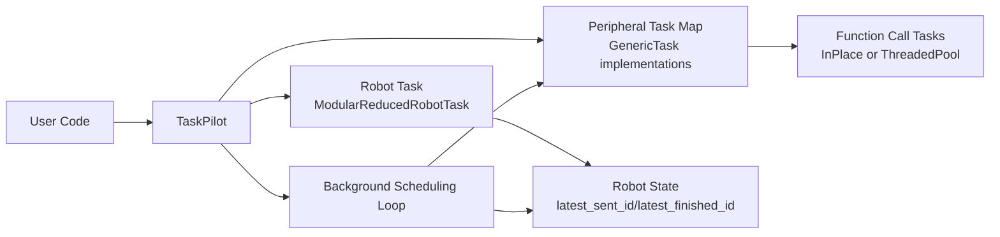

# Orchestrion

Lightweight Python framework for coordinating robot motion and asynchronous peripheral tasks.

Orchestrion centers around TaskPilot, which schedules robot trajectories and side tasks (for example, gripper actions) with optional motion synchronization.

## Features

- Task-based architecture for robot and peripheral execution.
- Asynchronous peripheral calls with in-memory or thread-pool execution strategies.
- Synchronization policies via MoveSyncOption:
  - run immediately (no sync)
  - sync with latest robot move
  - sync with an explicit move ID
- Modular robot abstraction with main module plus submodules.
- Background scheduling loop that dispatches synchronized tasks only when robot motion conditions are satisfied.

## Package Overview

- `orchestrion.task_pilot.TaskPilot`
  - Main orchestrator.
  - Queues background task requests.
  - Dispatches immediate tasks and synchronized tasks.
- `orchestrion.move_sync_option.MoveSyncOption`
  - Sync policy object for peripheral task calls.
- `orchestrion.tasks.modular_reduced_robot_task.ModularReducedRobotTask`
  - Base implementation for modular robot movement handling.
- `orchestrion.tasks.function_call_task.InPlaceFunctionCallTask`
  - Executes function calls inline and stores responses in memory.
- `orchestrion.tasks.function_call_task.ThreadedPoolFunctionCallTask`
  - Executes function calls in an external `ThreadPoolExecutor`.
- `orchestrion.utils.types.PeekResponseResult`
  - Unified response/result envelope for asynchronous task polling.

## Installation

### Prerequisites

- Python `>= 3.7`

### Install from source

```bash
pip install -e .
```

### Optional dependencies

- Logging colors:

```bash
pip install colorlog
```

- Viser demo stack:

```bash
pip install viser yourdfpy numpy
```

## Quick Start

```python
import concurrent.futures

from orchestrion.task_pilot import TaskPilot
from orchestrion.move_sync_option import MoveSyncOption

# Your robot task should implement/extend ModularReducedRobotTask.
robot_task = ...

# Your peripheral task should implement GenericTask-like invoke_async/peek_response behavior.
gripper_task = ...

executor = concurrent.futures.ThreadPoolExecutor(max_workers=2)

pilot = TaskPilot(
  robot_task=robot_task,
  task_map={"gripper": gripper_task},
  executor_owned=executor,
)

pilot.initialize()

# 1) Send robot trajectory
move_begin, move_end = pilot.move_joint_trajectory_async(
  motion_target=[[0.0, 0.1], [0.2, 0.3]],
  interval=0.01,
)

# 2) Trigger peripheral task synchronized with latest move
request_id = pilot.call_srv_async(
  "gripper",
  content={"action": "close"},
  sync_option=MoveSyncOption.sync_w_latest_move(),
)

# 3) Wait for robot completion
pilot.wait_move()

pilot.stop()
```

## Synchronization Model

`TaskPilot.call_srv_async(...)` accepts a `MoveSyncOption`:

- `MoveSyncOption.no_sync()`
  - Task is executed as soon as the background loop dequeues it.
- `MoveSyncOption.sync_w_latest_move()`
  - Task is associated with the latest known move ID at dispatch time.
- `MoveSyncOption.sync_w_explicit_id(move_id)`
  - Task runs only after robot state reports finishing that move ID.

## Architecture



At runtime, TaskPilot accepts two streams of work:

- Robot trajectory requests.
- Peripheral task requests (with or without synchronization constraints).

The background loop executes non-synchronized tasks immediately and delays synchronized tasks until robot state satisfies the requested move condition.

## Viser Integration Example

See:

- `integrations/viser/viser_modular_robot_task.py`
- `examples/viser/viser_modular_robot_task.py`

The example demonstrates:

- Loading URDFs for arm and gripper.
- Building a modular robot task.
- Sending pick-and-place trajectories.
- Scheduling gripper open/close actions synchronized with arm moves.

## Running Tests

```bash
python -m pytest -q tests/test_task.py
python -m pytest -q tests/test_task_pilot.py
python -m pytest -q tests/test_modular_robot_task.py
```

## Development Workflow

1. Create and activate a virtual environment.
2. Install project in editable mode.
3. Install test/runtime extras as needed.
4. Run focused test files during development.

Example:

```bash
python -m venv .venv
source .venv/bin/activate
pip install -e .
pip install pytest colorlog
python -m pytest -q tests/test_task.py
```

## Repository Structure

```text
orchestrion/
  task_pilot.py
  move_sync_option.py
  tasks/
    generic_task.py
    function_call_task.py
    modular_reduced_robot_task.py
    reduced_robot_task_interface.py
  utils/
    logger.py
    types.py

integrations/
  viser/
    viser_modular_robot_task.py

examples/
  viser/
    viser_modular_robot_task.py

tests/
  test_task.py
  test_task_pilot.py
```

## Notes

- This repository is framework-oriented: concrete robot backends should subclass or implement the provided task interfaces.
- `ThreadedPoolFunctionCallTask` expects an externally managed `ThreadPoolExecutor` passed through `initialize(executor=...)`.

## Troubleshooting

- `ModuleNotFoundError: colorlog`
  - Install `colorlog`, since logger setup imports it at runtime.
- `pytest: command not found`
  - Use `python -m pytest ...` inside your virtual environment, or install `pytest` first.
- Synchronized peripheral calls do not run yet
  - Check `MoveSyncOption` and verify robot state's `latest_finished_id` has reached the target move ID.
