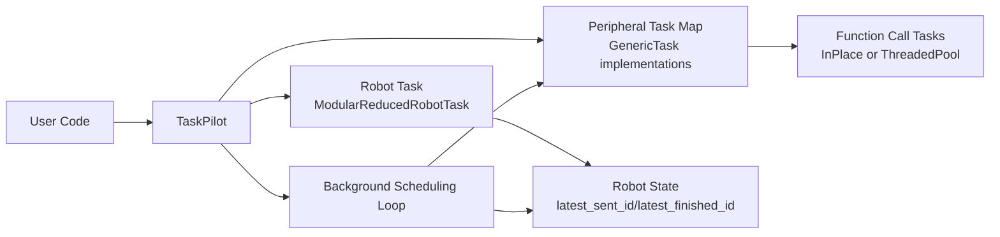
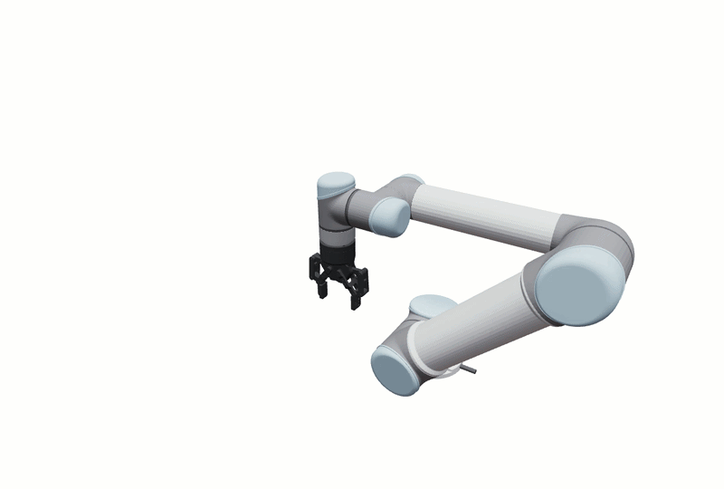

# Orchestrion

Lightweight Python framework for coordinating robot motion and asynchronous peripheral tasks.

Orchestrion centers around TaskPilot, which schedules robot trajectories and side tasks (for example, gripper actions) with optional motion synchronization.

## Features

- Task-based architecture for robot and peripheral execution.
- Asynchronous peripheral calls with in-memory or thread-pool execution strategies.
- Synchronization policies via MoveSyncOption:
  - run immediately (no sync)
  - sync with latest robot move
  - sync with an explicit move ID
- Modular robot abstraction with main module plus submodules.
- Unified request lifecycle with wait, cancellation, failures, and bounded timelines.
- Event-driven scheduling with polling fallback for legacy robot backends.
- Hardware-free `SimulatedRobotTask` for demos and integration tests.

## Package Overview

- `orchestrion.task_pilot.TaskPilot`
  - Main orchestrator.
  - Queues background task requests.
  - Dispatches immediate tasks and synchronized tasks.
- `orchestrion.move_sync_option.MoveSyncOption`
  - Sync policy object for peripheral task calls.
- `orchestrion.tasks.modular_reduced_robot_task.ModularReducedRobotTask`
  - Base implementation for modular robot movement handling.
  - Exposes independent submodule move IDs, state, waiting, and cancellation.
- `orchestrion.tasks.function_call_task.InPlaceFunctionCallTask`
  - Executes function calls inline and stores responses in memory.
- `orchestrion.tasks.function_call_task.ThreadedPoolFunctionCallTask`
  - Executes function calls in an external `ThreadPoolExecutor`.
- `orchestrion.utils.types.PeekResponseResult`
  - Unified response/result envelope for asynchronous task polling.

## Installation

### Prerequisites

- Python `>= 3.9`

### Install from source

```bash
pip install -e .
```

### Optional dependencies

- Logging colors:

```bash
pip install -e ".[color]"
```

- Viser demo stack:

```bash
pip install -e ".[viser]"
```

## Quick Start

```python
from orchestrion import MoveSyncOption, SimulatedRobotTask, TaskPilot
from orchestrion.tasks import InPlaceFunctionCallTask

class GripperTask(InPlaceFunctionCallTask):
    def _call_fn(self, request_id, content):
        return {"applied": content["action"]}

pilot = TaskPilot(SimulatedRobotTask([0.0, 0.0]), {"gripper": GripperTask()})
pilot.initialize()
try:
    _, move_end = pilot.move_joint_trajectory_async(
        [[0.0, 0.1], [0.2, 0.3]], interval=0.01
    )
    request_id = pilot.call_srv_async(
        "gripper",
        {"action": "close"},
        MoveSyncOption.sync_w_explicit_id(move_end - 1),
    )
    result = pilot.wait_request(request_id, timeout=2.0)
    print(result.status, result.content)
finally:
    pilot.stop()
```

Run the complete example from the repository root with
`python -m examples.simulated_pick_and_place`.

## Request Lifecycle

Every peripheral request progresses through `QUEUED`, optionally
`WAITING_FOR_MOVE`, then `RUNNING`, and finally `SUCCEEDED`, `FAILED`, or
`CANCELLED`.

```python
snapshot = pilot.query_request(request_id)
result = pilot.wait_request(request_id, timeout=1.0)
cancelled = pilot.cancel_request(request_id)
events = pilot.timeline(request_id)
removed = pilot.prune_completed_requests(keep_last=1000)
```

`wait_request` raises `TimeoutError` without cancelling the request. Cancellation
is guaranteed before execution and best-effort once a task is running.
Long-running processes can call `prune_completed_requests()` periodically to bound
stored terminal request results without removing active work.

## Synchronization Model

`TaskPilot.call_srv_async(...)` accepts a `MoveSyncOption`:

- `MoveSyncOption.no_sync()`
  - Task is executed as soon as the background loop dequeues it.
- `MoveSyncOption.sync_w_latest_move()`
  - Task is associated with the latest known move ID at dispatch time.
- `MoveSyncOption.sync_w_explicit_id(move_id)`
  - Task runs only after robot state reports finishing that move ID.

## Submodule Motion

Modular robots expose completion-aware motion for components such as grippers:

```python
move_id = robot.move_submodule_trajectory_async(
    "gripper", [[0.1], [0.2], [0.3]], interval=0.01
)
state = robot.query_submodule_state("gripper")
finished = robot.wait_submodule_move("gripper", move_id, timeout=1.0)
cancelled = robot.cancel_submodule_move("gripper", move_id)
```

`move_submodule_async()` remains as a boolean compatibility wrapper. New backends
should prefer the completion-aware API.

## Architecture



At runtime, TaskPilot accepts two streams of work:

- Robot trajectory requests.
- Peripheral task requests (with or without synchronization constraints).

The background loop executes non-synchronized tasks immediately and delays synchronized tasks until robot state satisfies the requested move condition.

## Viser Integration Example



See:

- `integrations/viser/viser_modular_robot_task.py`
- `examples/viser/README.md` for eight runnable visualization demos
- `examples/viser/viser_modular_robot_task.py` for the legacy entry point

The example demonstrates:

- Loading URDFs for arm and gripper.
- Building a modular robot task.
- Sending pick-and-place trajectories.
- Scheduling gripper open/close actions synchronized with arm moves.

## Running Tests

```bash
python -m pytest -q
python -m pytest -q tests/test_task.py
python -m pytest -q tests/test_task_pilot.py
python -m pytest -q tests/test_modular_robot_task.py
ruff check orchestrion integrations tests examples
```

## Development Workflow

1. Create and activate a virtual environment.
2. Install project in editable mode.
3. Install test/runtime extras as needed.
4. Run focused test files during development.

Example:

```bash
python -m venv .venv
source .venv/bin/activate
pip install -e .
pip install -e ".[dev,color]"
python -m pytest -q tests/test_task.py
```

## Repository Structure

```text
orchestrion/
  task_pilot.py
  move_sync_option.py
  request.py
  tasks/
    generic_task.py
    function_call_task.py
    modular_reduced_robot_task.py
    reduced_robot_task_interface.py
    simulated_robot_task.py
  utils/
    logger.py
    types.py

integrations/
  viser/
    viser_modular_robot_task.py

examples/
  simulated_pick_and_place.py
  viser/
    viser_modular_robot_task.py

tests/
  test_task.py
  test_task_pilot.py
```

## Notes

- This repository is framework-oriented: concrete robot backends should subclass or implement the provided task interfaces.
- `executor_owned` is shut down by `TaskPilot.stop()`; do not reuse it afterward.
- `stop(timeout=...)` does not wait indefinitely for a running Python callback that
  ignores cancellation; such a callback must still arrange its own cooperative exit.

## Troubleshooting

- Colored logs are optional; install them with `pip install -e ".[color]"`.
- `pytest: command not found`
  - Use `python -m pytest ...` inside your virtual environment, or install `pytest` first.
- Synchronized peripheral calls do not run yet
  - Check `MoveSyncOption` and verify robot state's `latest_finished_id` has reached the target move ID.
