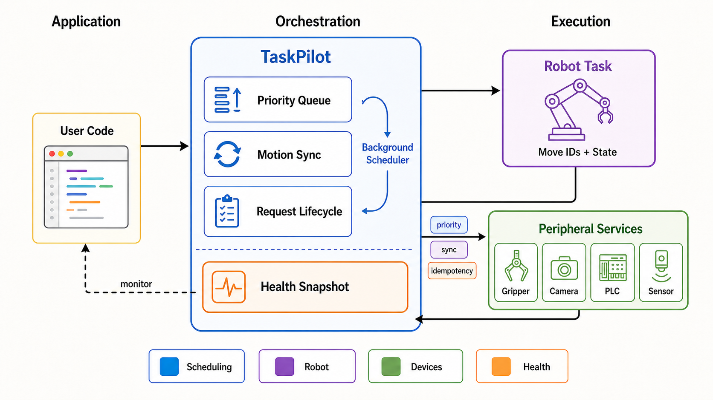
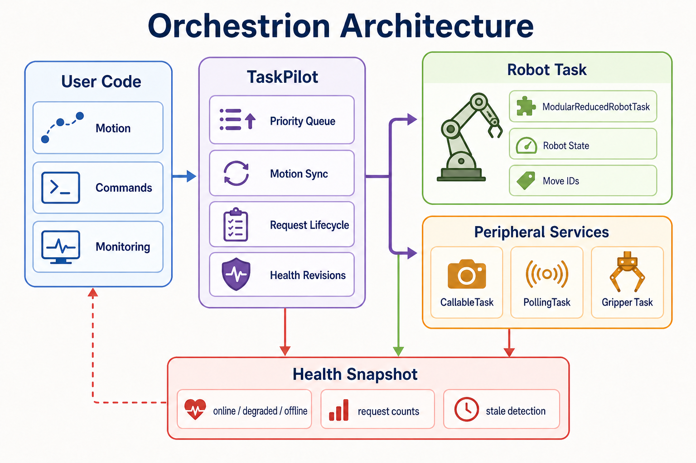
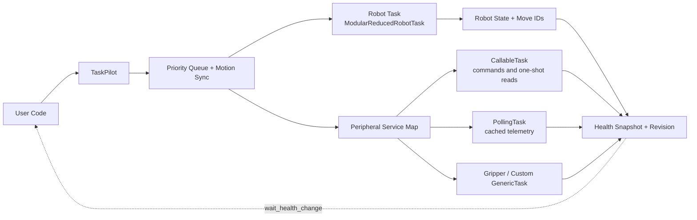
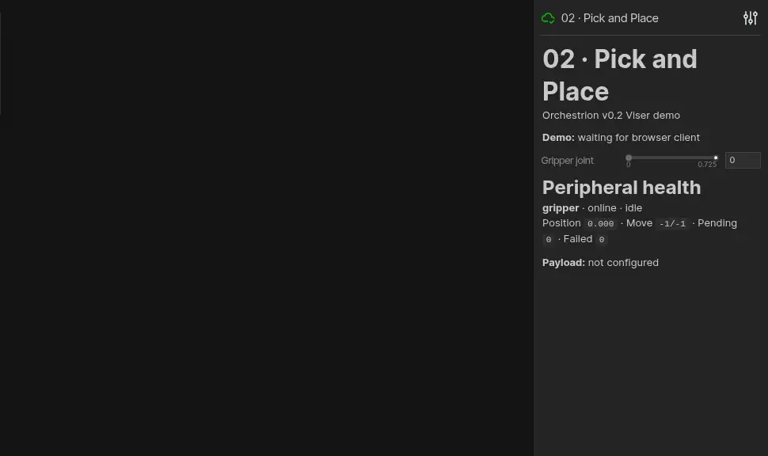

# Orchestrion

Lightweight Python framework for coordinating robot motion and asynchronous peripheral tasks.

Orchestrion centers around TaskPilot, which schedules robot trajectories and side tasks (for example, gripper actions) with optional motion synchronization.



## Features

- Task-based architecture for robot and peripheral execution.
- Asynchronous peripheral calls with in-memory or thread-pool execution strategies.
- Synchronization policies via MoveSyncOption:
  - run immediately (no sync)
  - sync with latest robot move
  - sync with an explicit move ID
- Modular robot abstraction with main module plus submodules.
- Unified request lifecycle with wait, cancellation, failures, and bounded timelines.
- Event-driven scheduling with polling fallback for legacy robot backends.
- Event-driven health revisions, normalized device health, and stale-data detection.
- Callable command adapters, bounded retries, and cached polling tasks for telemetry.
- Declarative request schemas that reject malformed commands before device I/O.
- Hardware-free `SimulatedRobotTask` for demos and integration tests.

## Package Overview

- `orchestrion.task_pilot.TaskPilot`
  - Main orchestrator.
  - Queues background task requests.
  - Dispatches immediate tasks and synchronized tasks.
- `orchestrion.move_sync_option.MoveSyncOption`
  - Sync policy object for peripheral task calls.
- `orchestrion.tasks.modular_reduced_robot_task.ModularReducedRobotTask`
  - Base implementation for modular robot movement handling.
  - Exposes independent submodule move IDs, state, waiting, and cancellation.
- `orchestrion.tasks.function_call_task.InPlaceFunctionCallTask`
  - Executes function calls inline and stores responses in memory.
- `orchestrion.tasks.function_call_task.ThreadedPoolFunctionCallTask`
  - Executes function calls in an external `ThreadPoolExecutor`.
- `orchestrion.tasks.function_call_task.CallableTask`
  - Wraps SDK functions as asynchronous services with optional bounded retry.
- `orchestrion.tasks.polling_task.PollingTask`
  - Polls continuous telemetry in the background and serves cached samples.
- `orchestrion.health.DeviceHealth`
  - Defines normalized connectivity and readiness states for device adapters.
- `orchestrion.utils.types.PeekResponseResult`
  - Unified response/result envelope for asynchronous task polling.

## Installation

### Prerequisites

- Python `>= 3.9`

### Install from source

```bash
pip install -e .
```

### Optional dependencies

- Logging colors:

```bash
pip install -e ".[color]"
```

- Viser demo stack:

```bash
pip install -e ".[viser]"
```

## Quick Start

```python
from orchestrion import MoveSyncOption, SimulatedRobotTask, TaskPilot
from orchestrion.tasks import InPlaceFunctionCallTask

class GripperTask(InPlaceFunctionCallTask):
    def _call_fn(self, request_id, content):
        return {"applied": content["action"]}

pilot = TaskPilot(SimulatedRobotTask([0.0, 0.0]), {"gripper": GripperTask()})
pilot.initialize()
try:
    _, move_end = pilot.move_joint_trajectory_async(
        [[0.0, 0.1], [0.2, 0.3]], interval=0.01
    )
    request_id = pilot.call_srv_async(
        "gripper",
        {"action": "close"},
        MoveSyncOption.sync_w_explicit_id(move_end - 1),
        priority=10,
        idempotency_key="pick-cycle-42/close",
    )
    result = pilot.wait_request(request_id, timeout=2.0)
    print(result.status, result.content)
finally:
    pilot.stop()
```

Run the complete example from the repository root with
`python -m examples.simulated_pick_and_place`.

## Request Lifecycle

Every peripheral request progresses through `QUEUED`, optionally
`WAITING_FOR_MOVE`, then `RUNNING`, and finally `SUCCEEDED`, `FAILED`, or
`CANCELLED`.

```python
snapshot = pilot.query_request(request_id)
result = pilot.wait_request(request_id, timeout=1.0)
results = pilot.wait_requests(request_ids, timeout=2.0)
cancelled = pilot.cancel_request(request_id)
cancelled_ids = pilot.cancel_all_requests(service_name="camera")
events = pilot.timeline(request_id)
removed = pilot.prune_completed_requests(keep_last=1000)
gripper_status = pilot.query_task_status("gripper")
all_peripherals = pilot.query_all_task_statuses()
health = pilot.query_health()
next_health = pilot.wait_health_change(health["revision"], timeout=5.0)
service_catalog = pilot.describe_services()
```

For applications that give the pilot lexical ownership, use its context manager
to guarantee shutdown:

```python
with TaskPilot(robot, {"gripper": gripper}, executor_owned=executor) as pilot:
    request_id = pilot.call_srv_async("gripper", {"action": "close"})
    result = pilot.wait_request(request_id, timeout=2.0)
```

`pilot.is_running` exposes lifecycle state, `pilot.service_names` lists registered
peripherals, and `pilot.task_map` returns a defensive copy of the registry.

`wait_request` raises `TimeoutError` without cancelling the request. Cancellation
is guaranteed before execution and best-effort once a task is running.
`wait_requests` applies one shared timeout budget to the entire group rather than
resetting the timeout for each request. `cancel_all_requests` can target all active
work or only one peripheral service.
Higher integer `priority` values run before lower-priority queued work. Priority
never preempts a running device action, and equal priorities preserve request-ID
order.
An optional `idempotency_key` deduplicates concurrent or repeated submissions for
the same service and returns the original request ID. Keys remain active while the
request is retained; `prune_completed_requests()` releases keys belonging to
removed records. Use stable operation IDs for actuator and PLC commands that may
be retransmitted after a network timeout.
Long-running processes can call `prune_completed_requests()` periodically to bound
stored terminal request results without removing active work.

Peripheral tasks can expose live health through `peek_status()`. TaskPilot provides
`query_task_status()` and `query_all_task_statuses()` as a uniform monitoring API;
built-in function tasks report retained, pending, succeeded, failed, and cancelled
request counts. A direct status query surfaces device errors to the caller. The
batch query is best-effort: a failing device returns
`{"available": False, "error": "..."}` without hiding healthy peripherals.
`query_health()` combines scheduler liveness, robot state, request counts, and all
peripheral statuses into one JSON-compatible snapshot for HTTP health endpoints,
dashboards, or metrics exporters.
Every snapshot contains a monotonic `revision`. `wait_health_change()` blocks until
robot, request, or peripheral state advances beyond that revision and returns
`None` on timeout, enabling event-driven dashboards without busy polling.
`describe_services()` returns static, JSON-compatible task type, execution mode,
capabilities, retry configuration, polling interval, and adapter metadata without
contacting hardware. Use it for service discovery and automatically generated UIs.

Simple SDK or I/O functions can be exposed without defining a task subclass:

```python
camera = CallableTask(
    lambda request_id, content: camera_sdk.capture(**(content or {})),
    status=lambda: {
        "health": "online",
        "observed_at": camera_sdk.last_frame_time,
        "device_type": "camera",
    },
    request_schema=RequestSchema(
        {
            "exposure_ms": FieldSpec(
                "number", required=True, minimum=0.1, maximum=100.0
            )
        }
    ),
    metadata={"commands": ["capture"], "device_type": "camera"},
)
```

`RequestSchema` validates flat command dictionaries before retry or adapter
execution. Its JSON-compatible description is included in `describe_services()`,
so control panels can discover required fields, numeric limits, and choices.

Run `python -m examples.simulated_multi_peripheral` for a hardware-free camera,
vacuum, PLC, and continuously polled temperature-sensor example. `CallableTask`
models commands and one-shot reads; `PollingTask` samples telemetry in the
background and serves the latest cached value. Pass `stale_after` to
`query_health()` to mark an online device as `degraded` when its adapter-provided
`observed_at` becomes too old.
Use `DeviceHealth` values (`unknown`, `connecting`, `online`, `degraded`, and
`offline`) in adapters; malformed health values and timestamps are rejected early.

Idempotent reads may opt into bounded retry with `RetryPolicy`. Retry is disabled
by default; do not enable it for non-idempotent actuator or PLC writes unless the
device protocol supplies an idempotency key:

```python
camera = CallableTask(
    capture,
    retry_policy=RetryPolicy(
        max_attempts=3,
        delay=0.1,
        backoff=2.0,
        retry_exceptions=(ConnectionError, TimeoutError),
    ),
)
```

## Synchronization Model

`TaskPilot.call_srv_async(...)` accepts a `MoveSyncOption`:

- `MoveSyncOption.no_sync()`
  - Task is executed as soon as the background loop dequeues it.
- `MoveSyncOption.sync_w_latest_move()`
  - Task is associated with the latest known move ID at dispatch time.
- `MoveSyncOption.sync_w_explicit_id(move_id)`
  - Task runs only after robot state reports finishing that move ID.

## Submodule Motion

Modular robots expose completion-aware motion for components such as grippers:

```python
move_id = robot.move_submodule_trajectory_async(
    "gripper", [[0.1], [0.2], [0.3]], interval=0.01
)
state = robot.query_submodule_state("gripper")
finished = robot.wait_submodule_move("gripper", move_id, timeout=1.0)
cancelled = robot.cancel_submodule_move("gripper", move_id)
```

`move_submodule_async()` remains as a boolean compatibility wrapper. New backends
should prefer the completion-aware API.

## Architecture



The infographic provides the quick visual overview; the source-controlled diagram
below is the authoritative component map.



At runtime, TaskPilot accepts two streams of work:

- Robot trajectory requests.
- Peripheral task requests (with or without synchronization constraints).

The background loop executes non-synchronized tasks immediately and delays synchronized tasks until robot state satisfies the requested move condition.

## Viser Integration Example



Run the featured scene with `python -m examples.viser 02`. It visualizes the
arm trajectory, synchronized gripper state, attached payload, phase progress,
and live peripheral health in one browser view. The animation above is captured
from that real workflow rather than a mocked rendering.

See:

- `integrations/viser/viser_modular_robot_task.py`
- `examples/viser/README.md` for eight runnable visualization demos
- `examples/viser/viser_modular_robot_task.py` for the legacy entry point

The example demonstrates:

- Loading URDFs for arm and gripper.
- Building a modular robot task.
- Sending pick-and-place trajectories.
- Scheduling gripper open/close actions synchronized with arm moves.
- Monitoring request progress and peripheral health from the Viser panel.

## Running Tests

```bash
python -m pytest -q
python -m pytest -q tests/test_task.py
python -m pytest -q tests/test_task_pilot.py
python -m pytest -q tests/test_modular_robot_task.py
ruff check .
```

## Development Workflow

1. Create and activate a virtual environment.
2. Install project in editable mode.
3. Install test/runtime extras as needed.
4. Run focused test files during development.

Example:

```bash
python -m venv .venv
source .venv/bin/activate
pip install -e .
pip install -e ".[dev,color,viser]"
python -m pytest -q tests/test_task.py
```

## Repository Structure

```text
orchestrion/
  task_pilot.py
  move_sync_option.py
  request.py
  health.py
  retry.py
  schema.py
  tasks/
    generic_task.py
    function_call_task.py
    modular_reduced_robot_task.py
    polling_task.py
    reduced_robot_task_interface.py
    simulated_robot_task.py
  utils/
    logger.py
    types.py

integrations/
  viser/
    viser_modular_robot_task.py

examples/
  simulated_multi_peripheral.py
  simulated_pick_and_place.py
  viser/
    01_joint_sweep.py ... 08_gripper_lab.py
    common.py

tests/
  test_schema.py
  test_task.py
  test_task_pilot.py
  test_v02.py
  test_viser_examples.py
```

## Notes

- This repository is framework-oriented: concrete robot backends should subclass or implement the provided task interfaces.
- `executor_owned` is shut down by `TaskPilot.stop()`; do not reuse it afterward.
- `stop(timeout=...)` does not wait indefinitely for a running Python callback that
  ignores cancellation; such a callback must still arrange its own cooperative exit.

## Troubleshooting

- Colored logs are optional; install them with `pip install -e ".[color]"`.
- `pytest: command not found`
  - Use `python -m pytest ...` inside your virtual environment, or install `pytest` first.
- Synchronized peripheral calls do not run yet
  - Check `MoveSyncOption` and verify robot state's `latest_finished_id` has reached the target move ID.
